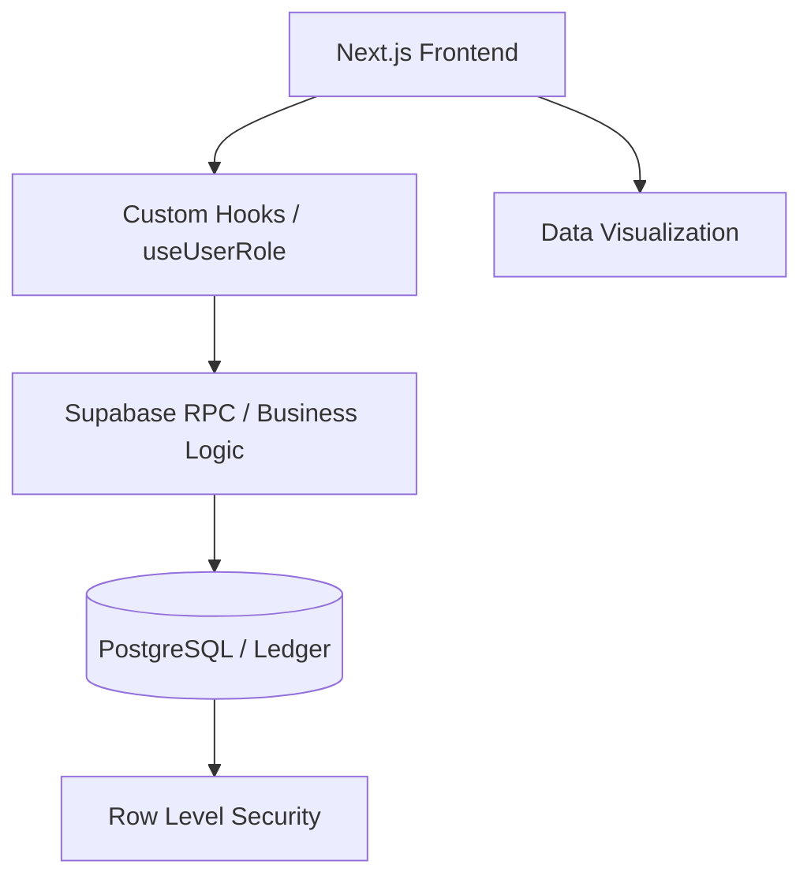

# Design Document: CA Engine ERP Platform

## Project Overview
**CA Engine** is an enterprise-grade ERP platform designed to automate and modernize Chartered Accounting workflows. Built for high-performance financial management, it transitions from basic CRUD operations to a strictly governed **Double-Entry Accounting Engine**. 

The system provides a central source of truth for corporate financials, ensuring transaction integrity through atomic ledger updates, automated inventory valuation (COGS), and predictive financial forecasting. It is designed to serve as a robust foundation for corporate governance and real-time financial transparency.

---

## Requirements

### Functional Requirements
- **Double-Entry Ledger Engine**: Atomic recording of transactions where `Assets = Liabilities + Equity`.
- **Automated Inventory & COGS**: Real-time stock tracking with automatic COGS calculation and multi-line journaling.
- **Bank Reconciliation Algorithm**: Matching internal ledger records with external bank statement CSVs via an automated heuristic engine.
- **Dynamic Financial Reporting**: Real-time generation of Income Statements (P&L), Balance Sheets, and Trial Balances.
- **Predictive Analytics**: 6-month cash flow forecasting using historical run-rates and linear interpolation.
- **Export Capabilities**: Generation of corporate-ready PDF financial artifacts.

### Non-Functional Requirements
- **Data Integrity**: Enforcement of atomic transactions via Database RPCs to prevent unbalanced ledger states.
- **Security & RBAC**: Granular Row-Level Security (RLS) and custom Role-Based Access Control (Admin, Data Entry, Auditor).
- **Scalability**: Utilizing a serverless, decoupled architecture (Next.js/Supabase) for global availability.
- **User Experience**: High-performance UI built with Tailwind CSS 4 and shadcn/ui, featuring micro-animations and responsive layouts.
- **Performance**: Edge-optimized rendering via React Server Components and client-side visualization.

---

## Use Cases

| Actor | Action | Result |
| :--- | :--- | :--- |
| **Admin** | Manage Chart of Accounts | Updates the core financial structure governing all transactions. |
| **Data Entry** | Record Inventory Sale | Triggers COGS calculation, inventory reduction, and automated 4-line journal entry. |
| **Accountant** | Upload Bank Statement | Heuristic engine matches CSV records with internal ledger for reconciliation. |
| **Auditor** | View Audit Logs | Read-only access to immutable system logs for compliance verification. |
| **Manager** | View Forecast | Recharts-powered dashboard visualizes projected cash flow runways. |

---

## System Architecture

### Architectural Pattern
The system follows a **Decoupled Client-Server Architecture** with a focus on **Event-Driven Database Logic**:
- **Application Layer**: Next.js App Router providing a unified SSR/CSR experience.
- **Business Logic Layer**: Hybrid implementation using React Hooks for UI logic and **Postgres RPCs** for mission-critical, atomic financial operations.
- **Infrastructure Layer**: Supabase providing Auth, PostgreSQL, and Storage as a managed, serverless backend.

### Component Relationship

---

## Technology Stack
- **Frontend**: [Next.js 16 (App Router)](https://nextjs.org/), [React 19](https://react.dev/)
- **Styling**: [Tailwind CSS 4](https://tailwindcss.com/), [shadcn/ui](https://ui.shadcn.com/)
- **Backend-as-a-Service**: [Supabase](https://supabase.com/)
- **Database**: [PostgreSQL](https://www.postgresql.org/) (with Row Level Security)
- **Data Visualization**: [Recharts](https://recharts.org/)
- **Utilities**: [Papaparse](https://www.papaparse.com/) (CSV), [jsPDF](https://github.com/parallax/jsPDF) (Reporting)

---

## Data Model

### Core Entities
1. **Companies**: The root entity for multi-tenant isolation.
2. **Users / CompanyUsers**: RBAC association mapping users to companies with specific roles.
3. **Chart of Accounts (COA)**: The hierarchy of financial buckets (Asset, Liability, Equity, Revenue, Expense).
4. **Journal Entries**: Header records for financial events (Date, Description, Company).
5. **Ledger Entries**: The atomic line items for each journal entry (Account, Debit/Credit Amount).
6. **Inventory Items**: Goods for sale with SKU, Purchase Price, and Quantity on Hand.

### Relationships
- A `Company` has many `Accounts`, `InventoryItems`, and `JournalEntries`.
- A `JournalEntry` has two or more `LedgerEntries` (balancing to zero).
- `LedgerEntries` link `JournalEntries` to specific `Accounts`.

---

## API Design / Component Interface

### Core Database RPCs (Supabase)
- `record_inventory_sale(p_item_id, p_quantity, ...)`: Handles complex multi-table updates (Inventory, COGS, Ledger) in a single transaction.
- `get_financial_report(p_type, p_start_date, p_end_date)`: Aggregates ledger entries into structured JSON for P&L or Balance Sheet generation.

### Key UI Components
- **`FinancialCard`**: High-level summary of account balances with sparkline charts.
- **`SalesTerminal`**: Interactive form for processing sales with real-time stock validation.
- **`ReportEngine`**: Dynamic table generator with PDF export functionality.

---

## Security & Deployment

### Authentication & Authorization
- **Supabase Auth**: JWT-based authentication with persistence.
- **RLS (Row Level Security)**: PostgreSQL policies ensuring users can only read/write data belonging to their specific `company_id`.
- **RBAC Hook**: `useUserRole` validates UI permissions on the client and server.

### Deployment Strategy
- **Frontend Hosting**: Vercel (or similar) with CI/CD integration.
- **Database Hosting**: Supabase Managed Cloud (PostgreSQL on AWS).
- **Environment Management**: Separation of `.env.local` for development and production-grade secrets management.

---

## Instructions for the IDE
- All database modifications to the ledger **must** be performed via the `record_inventory_sale` or equivalent RPCs to ensure atomicity.
- Use the `useUserRole` hook to guard sensitive routes and UI elements.
- New UI components should strictly adhere to the `Tailwind CSS 4` and `shadcn/ui` design patterns defined in `components.json`.
